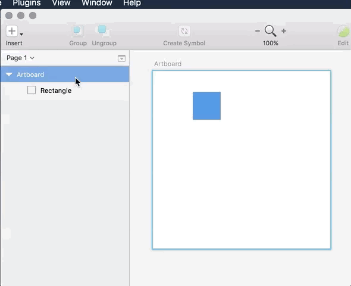
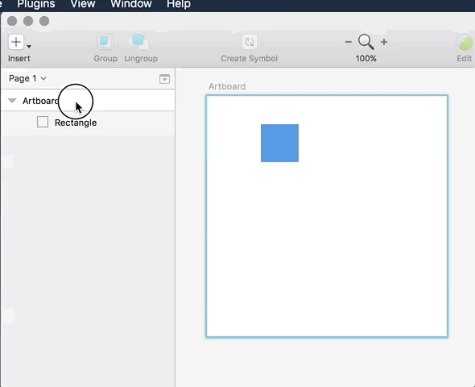
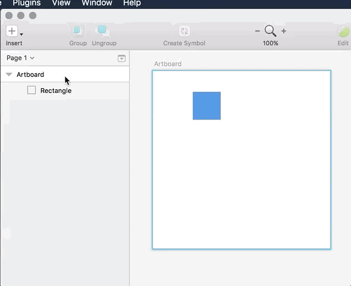

# Tile Hero
Sketch plugin to auto generate tiles

## Features

■ Uniform Fill

- Repeats layers in every selected Artboards
- You can define the separation
- Need to have at least 1 Artboard selected

■ Checkered Fill

- Repeats layers in every selected Artboards
  with a checkered pattern
- Need to have at least 1 Artboard selected

■ Random Uniform-spaced

- Repeats layers in every selected Artboards
  with a random pattern, empty spaces are of
  the same size as the layer being repeated
- You can define the repeat ratio
- Need to have at least 1 Artboard selected

■ Random Dynamic-spaced

- Repeats layers in every selected Artboards
  with a random pattern
- You can define the repeat ratio
- Need to have at least 1 Artboard selected

